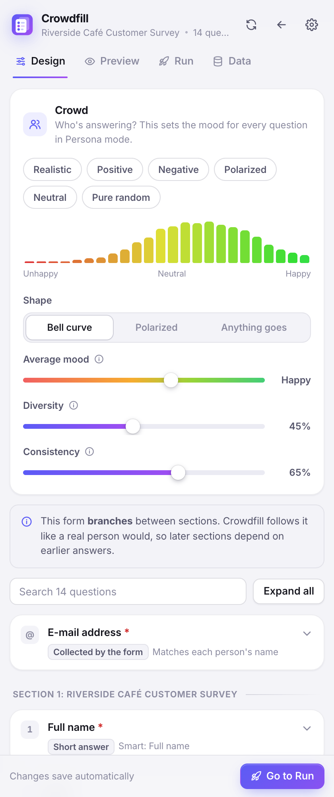
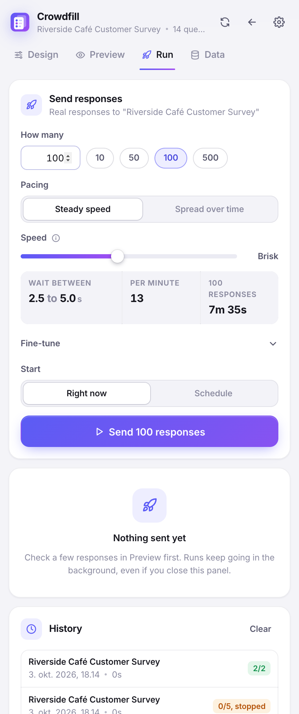
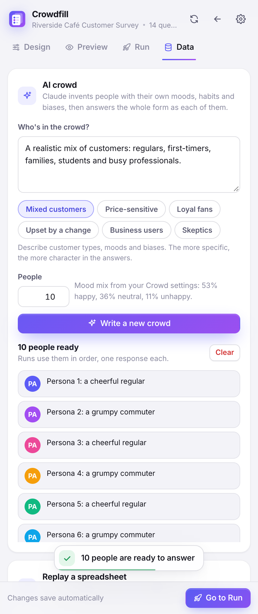

<p align="center">
  
</p>

<h1 align="center">Crowdfill</h1>

<p align="center">
  Fill your Google Forms with realistic responses that lean the way you choose.<br>
  Free, open source, and everything stays in your browser.
</p>

<p align="center">
  <a href="https://dyrt.io/crowdfill/">Website</a> &nbsp;|&nbsp;
  <a href="https://www.youtube.com/watch?v=VyyYjKN6g_M">Video</a> &nbsp;|&nbsp;
  <a href="legal/privacy.md">Privacy</a> &nbsp;|&nbsp;
  <a href="legal/terms.md">Terms</a> &nbsp;|&nbsp;
  <a href="CHANGELOG.md">Changelog</a>
</p>

<p align="center">
  
  
  
</p>

---

Filling in a form by hand fifty times to see if a dashboard works is miserable, and most random fillers produce data that looks nothing like real people. Real respondents have moods. A happy customer rates high, recommends you and writes something nice. An annoyed one does the opposite, all the way through. Crowdfill generates people like that.

Use it to test a form before you share it, fill a dashboard with believable demo data, or show a room full of people what results look like when the crowd leans positive, negative or splits down the middle.

## What it does

**Pick a tendency and see it happen.** Every question can lean towards an answer. Slide the strength from "plain random" to "almost always", and on scales the extra weight spills naturally onto neighbouring answers. Or set the exact split per option and watch the percentages update.

**Give the crowd a mood.** Choose a bell curve, a polarized crowd or anything-goes, then set the average mood, how different people are, and how consistent each person is. Every satisfaction score, NPS rating, agree/disagree answer and grid rating from one person then fits together.

**Let Claude write the people.** The AI crowd invents respondents with their own customer type, mood and biases (price-sensitive students, loyal regulars, people upset about a recent change, whatever you describe) and answers the whole form as each of them. It uses your own Anthropic API key, and you only pay for what you generate.

**Text that makes sense.** Names, e-mails, phone numbers, ages, cities, comments and suggestions are matched to the question, and one person's name and e-mail agree. Templates, lists and number ranges are there when you want control.

**Respects your form.** Number ranges, text lengths, e-mail and URL rules, regular expressions and checkbox limits all pass. Section branching is followed the way a real person would follow it.

**Preview first.** Generate up to 2,000 responses on the spot and look at the distributions before anything is sent. Export CSV or JSON, open any response as a pre-filled link, or fill the open form on screen.

**Then let it run.** Set the speed with a slider and see the wait time, responses per minute and total duration change as you drag. Or spread responses over an hour like real traffic. Runs keep going in the background with retries, pause, stop, scheduling and a notification at the end.

**Replay real data.** Drop in a CSV, like a Google Forms response export, and Crowdfill sends its rows. Columns match up to questions automatically.

## How it compares

| | Crowdfill | Borang | Google Forms Auto Filler |
|---|---|---|---|
| Price | Free and open source | Free tier, paid Premium | Free |
| Many responses at once | Yes, no limit | Premium for unlimited | No, fills one form |
| Random answers | Yes | Premium | No |
| Exact weights per option | Yes | Premium | No |
| Tendency with natural spread on scales | Yes | Not advertised | No |
| Crowd moods that keep answers consistent | Yes | Not advertised | No |
| AI-written respondents | Yes, bring your own key | Premium | No |
| Follows section branching | Yes | Not advertised | Not advertised |
| Passes validation rules, including regex | Yes | Not advertised | Not advertised |
| Preview with distributions | Yes | Not advertised | Not advertised |
| Speed slider with live numbers | Yes | Premium (speed control) | No |
| Scheduling | Yes | Premium | No |
| CSV replay | Yes | Premium | No |
| Fill the open form on screen | Yes | Not advertised | Yes |
| Microsoft Forms | No | Yes | No |

<sub>Based on the public store listings and websites of each extension in October 2026.</sub>

## Install

**From the Chrome Web Store.** Search for Crowdfill, or use the link on [dyrt.io/crowdfill](https://dyrt.io/crowdfill/).

**From a release zip.** Unzip it, open `chrome://extensions`, switch on Developer mode, click "Load unpacked" and pick the folder.

**From source.**

```bash
npm install
npm run build
```

Then load the `dist` folder the same way. Works in Chrome, Edge, Brave and other Chromium browsers, version 116 or newer.

## Getting started

1. Open your Google Form and click the Crowdfill icon, or press <kbd>Alt</kbd>+<kbd>Shift</kbd>+<kbd>F</kbd>. Crowdfill opens next to the form and reads it.
2. In **Design**, pick a crowd (Realistic, Positive, Negative, Polarized, Neutral or Pure random) and adjust any question you care about.
3. In **Preview**, look at a few hundred sample responses and the way the answers spread.
4. In **Run**, choose how many and how fast, then press Send.

Each form remembers its own setup. You can export it from **Data** to share it or keep it in git.

## Answer strategies

| Strategy | What it does |
|---|---|
| Persona | Follows each person's mood. Works on scales, ratings, grids and options that read like a scale ("Strongly disagree" to "Strongly agree", "Poor" to "Excellent", 1 to 10). |
| Random | Every option equally likely. |
| Tendency | Random, but leaning towards the option you pick, as strongly as you like. |
| Weighted | You set the exact share of each option. |
| Fixed | Always the same answer. |
| Cycle | Goes through the options in order, so each one gets covered. |

Checkboxes can be random, have a chance per option, or be a fixed set, with a minimum and maximum. Text can come from the smart generator, a template, a list, a number range, a fixed value or lorem ipsum. Dates and times take a range.

<details>
<summary><b>Template tokens</b></summary>

| Token | Gives you |
|---|---|
| `{firstName}` `{lastName}` `{fullName}` | The person's name |
| `{email}` `{username}` `{phone}` | Contact details that match the name |
| `{age}` `{city}` `{country}` `{company}` `{jobTitle}` | More about the person |
| `{number:1-100}` | A whole number in a range |
| `{decimal:0-10:2}` | A decimal with 2 digits |
| `{pick:red\|green\|blue}` | One of the listed values |
| `{feedback}` `{suggestion}` | A comment or suggestion in the person's mood |
| `{sentence}` `{paragraph}` `{words:3}` | Lorem ipsum |
| `{digits:6}` `{letters:4}` | Random digits or letters |
| `{index}` | The response number |
| `{date}` `{uuid}` | Today's date, or a random UUID |

</details>

## Good to know

- Crowdfill is for forms you own or have permission to test. Please read the [Acceptable Use Policy](legal/acceptable-use.md).
- Forms limited to one response per person, or that collect verified e-mails, need a Google account per response. Crowdfill can only submit those as you, and doesn't try to get around that.
- File upload questions can't be answered automatically.
- Very fast runs can get rate-limited by Google. Crowdfill backs off and retries, but slower is more reliable.
- Scheduled runs need the browser to be open at the start time.

## Privacy

There are no Crowdfill servers, no accounts and no analytics. Your forms, settings and history stay in your browser. Crowdfill only talks to Google Forms, and to Anthropic if you add an API key. The full policy is in [legal/privacy.md](legal/privacy.md).

## Building it yourself

```bash
npm install
npm run dev          # rebuilds dist/ as you edit
npm test             # unit tests
npm run check        # text check, types, tests and a build
npm run e2e          # the real extension in Chrome for Testing, fully offline
npm run screenshots  # e2e plus fresh screenshots in docs/
npm run package      # release/crowdfill-<version>.zip
npm run store-assets # Chrome Web Store images in docs/store
npm run site         # refreshes the policy pages, screenshots and video on dyrt.io (see scripts/build-site.mjs)
npm run video        # the narrated showcase video (see video/README.md)
```

The end-to-end suite downloads Chrome for Testing the first time. It answers every request to Google and Anthropic itself, so it never touches the real services.

```
src/core        the logic: parser, generator, distributions, text, validation, payload
src/background  service worker: messages, the run engine, scheduling, Claude
src/content     fills the open form on screen
src/ui          the side panel, built with Preact
legal/          terms, privacy, acceptable use, licenses (also built into the extension)
docs/           architecture notes, screenshots, store upload guide
video/          the showcase video renderer
```

[docs/ARCHITECTURE.md](docs/ARCHITECTURE.md) explains how Google Forms are read and submitted, and how the crowd model works.

## Contributing

Ideas, bug reports and pull requests are welcome. [CONTRIBUTING.md](CONTRIBUTING.md) has the details. Security issues go to dev@dyrt.io.

## License

The code is MIT licensed, see [LICENSE](LICENSE). The Crowdfill name and logo belong to dyrt.io. Crowdfill is not affiliated with Google, and Google Forms is a trademark of Google LLC.

Made by Simon at [dyrt.io](https://dyrt.io).
